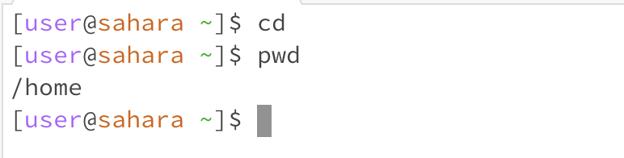
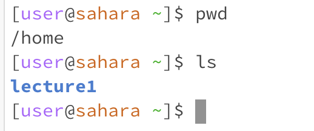
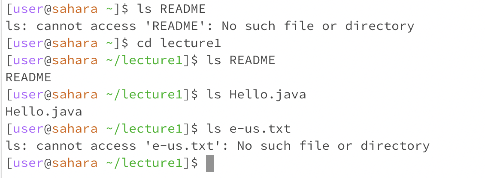

**Share an example of using the command with no arguments.**
*No argument means that you just type in "cd", "ls", and "cat" in the terminal and nothing after it.*

Using "CD" without an argument takes us back to the home directory or the previous directory.

Using "ls" without an argument lists all the files and folders in the current directory.

Using "cat" without an argument makes it wait for an input. Once you type and input something, it will print out what you just put on the terminal.

**Share an example of using the command with a path to a directory as an argument.**
*With a path to a directory means that after typing "cd", "ls", and "cat", you also type in a directory name.*

Using  "cd" with a path to a directory as an argument changes the current directory to the chosen directory. You cannot access directories that are not in the current directory or else the terminal will display "no such directory or file."

Using "ls" with a path to a directory as an argument shows all the files/folders that are within the chosen directory. You cannot use "ls" to access directories that are not within the current directory.

Using "cat" with a path to a directory as an argument prints information that the chosen directory is a directory. "cat" will tell you what the argument type is. Since we have a path to a directory as our argument, then "cat" will display that the chosen directory is a directory.

**Share an example of using the command with a path to a file as an argument.**
*With a path to a file as an argument means that after typing in "cd", "ls", and "cat", you also type a file name after the initial command.

Using "cd" with a path to a file as an argument with print out the error message: "not a directory." Since "cd" stands for "change directory," trying to pass a file as an argument will prompt the error message because a file is not a directory.

Using "ls" with a path to a file as an argument will print out the file name. You cannot use "ls" on files that are outside of the current directory.

Using "cat" with a path to a file as an argument will print out the contents in the file. You cannot access files that are outside of the current directory.
