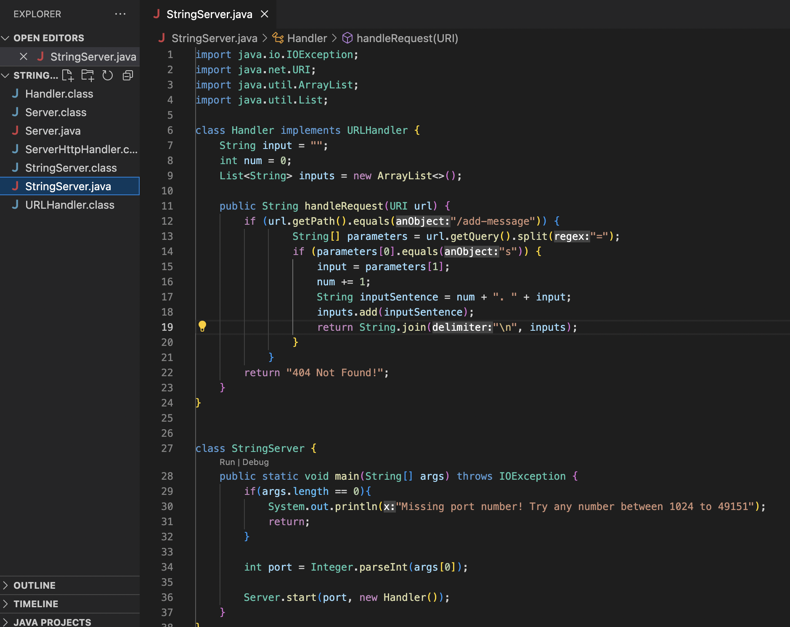
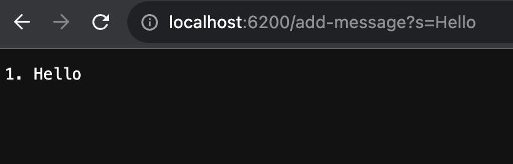
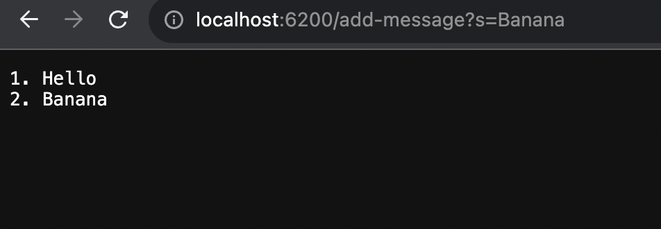
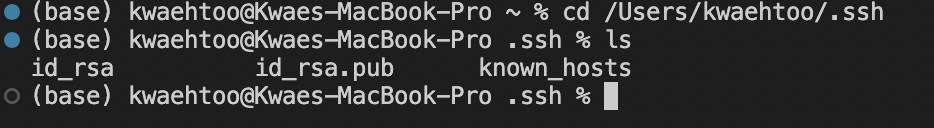
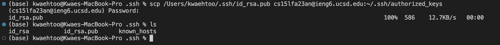

**CSE 15L LAB REPORT 2**
**Kwae Htoo, A17327141**

**PART 1**
**Show the code for your StringServer, and two screenshots of using /add-message.**

*Code for String Server*

*Using add-message one time to add "Hello"*
1. The handleRequest(URI url) was called.
   Code Block:
   

3. The relevant argument to the handleRequest method is the URI that the method takes in. The relevant fields are num, input, and inputs.      The num which is an integer is set to 0. The input which is a string type is an empty string. The inputs is an array list type and is 
   empty.
4. For the first ever request, and in this case is "Hello". The input is set to "Hello". The number is incremented so that means num is now 
   equal to 1. In the array list inputs, the string "1. Hello" is added to the list. In conclusion, the fields are now:
       - input = "Hello"
       - num = 1;
       - inputs = {"1. Hello"}

*Using add-message a second time to add "Banana"*
1. The handleRequest(URI url) was called.
2. The relevant argument to the handleRequest method is the URI that the method takes in. The relevant fields are now num = 1,
   input = "Hello", and inputs={"1. Hello"}.
3. For the second request which is "Banana". The input is now changed and set to "Banana". The number is increment so that means the num is 
   now 2. In the array list inputs, the string "2. Banana" is added to the list. In conclusion, the fields are now:
       - input = "Banana"
       - num = 2
       - inputs = {"1. Hello", "2. Banana"}

**PART 2**
**Using the command line, show with "ls" and take screenshots of:**

**The path to the private key for your SSH key for logging into ieng6 (on your computer or on the home directory of the lab computer)**

- Out of the three files, the private key is **id_rsa**.

**The path to the public key for your SSH key for logging into ieng6 (within your account on ieng6)**

**A terminal interaction where you log into ieng6 with your course-specific account without being asked for a password.**

**PART 3**
**In a couple of sentences, describe something you learned from lab in week 2 or 3 that you didn’t know before.**

Something that I learned that I didn't know before was creating and starting a server. It was less complicated than I thought it would be. All you need to do is create a server java file and the server you want to create and boom, you have a server.
